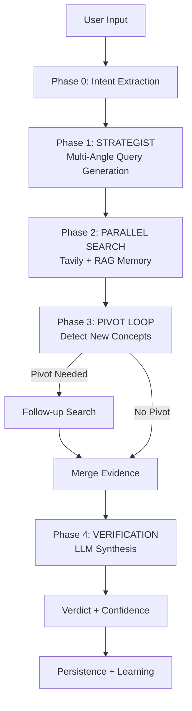
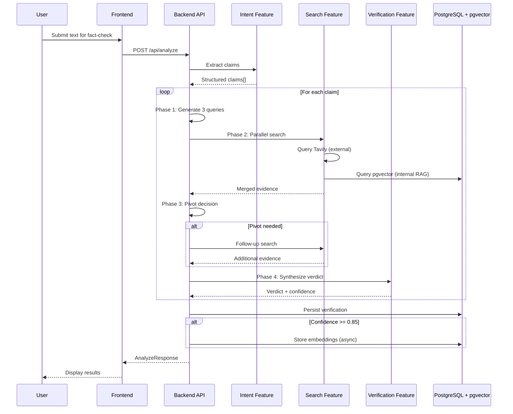

# Architecture Overview

High-level system design for FactuAI's fact-checking pipeline.

---

## What is FactuAI?

FactuAI is a full-stack AI-powered fact-checking system that:

- **Extracts claims** from user input (LLM-based intent extraction)
- **Generates multi-angle search queries** (Strategist phase)
- **Gathers evidence** from external sources + internal knowledge base (Parallel Search)
- **Performs follow-up research** when new concepts are discovered (Pivot Loop)
- **Synthesizes verdicts** with confidence scores (LLM Verification)
- **Learns continuously** by storing high-confidence results in pgvector (RAG feedback loop)

**Tech Stack:**
- Backend: **Native async FastAPI**
- Database: PostgreSQL 16 + **pgvector** extension
- Caching: Redis
- Architecture: **Vertical Slice** + Ports/Adapters + Dependency Injection (OCP)
- Frontend: Next.js (App Router), TypeScript, Tailwind

---

## The 4-Phase Analysis Pipeline

FactuAI uses a sophisticated multi-stage pipeline for robust claim verification:



### Phase Summaries

| Phase | Name | Purpose | Key Tech |
|-------|------|---------|----------|
| **0** | Intent Extraction | Parse raw text into structured claims | `LLMIntentAdapter` |
| **1** | Strategist | Generate 3 multi-angle search queries | LLM prompt engineering |
| **2** | Parallel Search | Gather evidence from Tavily + pgvector | `asyncio.gather`, Tavily API |
| **3** | Pivot Loop | Detect new concepts → follow-up research | LLM decision + recursive search |
| **4** | Verification | Synthesize evidence into verdict | LangChain structured output |

See [../04-pipeline/00-overview.md](../04-pipeline/00-overview.md) for detailed pipeline documentation.

---

## Architecture Principles

### 1. Async-First
All I/O operations use async/await:
- HTTP: `httpx.AsyncClient`
- Database: SQLAlchemy async + `asyncpg`
- Redis: `redis.asyncio`
- **No sync wrappers, no thread bridges**

### 2. Vertical Slice Architecture (VSA)
Code is organized by **feature**, not by layer:

```
backend/app/features/
├── analyze/       # Orchestrates full fact-check flow
├── intent/        # Claim extraction
├── search/        # Search providers (Tavily, RAG)
├── system/        # Config API for frontend
└── verification/  # Verdict generation
```

Each feature owns:
- API boundary (`router.py`)
- Orchestration logic (`service.py`)
- Ports & adapters
- Feature-specific persistence

**Rule:** Features never import other features. Shared types live in `backend/app/contracts/`.

###3. Open/Closed Principle (OCP) + Dependency Injection

Extend behavior via **new implementations** + **config**, not by modifying orchestrators.

**DI Container:** `backend/app/core/container.py`  
**Config:** `backend/app/core/settings.py`

**Example:**
```python
# Add a new search provider without changing orchestration code
SEARCH_PROVIDER_PATHS=backend.app.features.search.providers.tavily.TavilyProvider,backend.app.features.search.providers.custom.MyProvider
```

---

## Key Design Patterns

### Fail-Fast Pre-flight Checks
The `/api/analyze` endpoint validates infrastructure connectivity **before** expensive operations:
- Database connection
- LLM provider reachability

If infrastructure is unhealthy, returns `503 Service Unavailable` immediately.

### Strict Source Filtering (The Gatekeeper)
All external search results are filtered against a **Social Media Blocklist**:
- Blocked domains: Facebook, TikTok, Twitter/X, Reddit, Instagram, YouTube, Medium, Wikipedia
- Implementation: Tavily's `exclude_domains` parameter
- **Rationale:** Social media is a vector for misinformation

See [../05-features/source-filtering.md](../05-features/source-filtering.md).

### Continuous Learning (RAG Feedback Loop)
After **high-confidence** verifications (confidence ≥ 0.85):
1. System asynchronously generates embeddings for claims and evidence
2. Stores in pgvector columns (`claim_embedding`, `snippet_embedding`)
3. Future searches query internal knowledge base via cosine similarity

See [../05-features/continuous-learning.md](../05-features/continuous-learning.md).

---

## System Components

### Backend Stack
- **Framework:** FastAPI (async)
- **ORM:** SQLAlchemy (async mode) + asyncpg
- **Database:** PostgreSQL 16 with pgvector extension
- **Cache:** Redis (async client)
- **HTTP:** httpx AsyncClient
- **LLM Orchestration:** LangChain (`langchain-openai`)

### Frontend Stack
- **Framework:** Next.js 16 (App Router, Turbopack)
- **Language:** TypeScript
- **Styling:** Tailwind CSS v4
- **State:** Zustand (feature stores)
- **Testing:** Vitest

### Feature-Based Colocation (Frontend)
Domain logic is organized by feature, not by component type:

```
frontend/src/features/
├── ai-providers/    # Model selection, pipeline config
├── search/          # Search input, provider config
├── analyze/         # Results display, claim cards
└── history/         # History panel, session management
```

**Rule:** Domain components *must* live in `features/`, NOT in `components/`. The `components/` directory is reserved for generic UI primitives only.

See [frontend.md](frontend.md) for details.

---

## Entry Points

| Component | Entry Point |
|-----------|-------------|
| Backend app | `backend/app/main.py` |
| Settings/config | `backend/app/core/settings.py` |
| DI container | `backend/app/core/container.py` |
| DB initialization | `backend/app/core/db.py` |
| Migrations | `backend/migrations/*.sql` |
| Frontend app | `frontend/src/app/page.tsx` |

---

## Where Things Live

**Backend feature slices:**
- `backend/app/features/analyze/` - API boundary, full orchestration
- `backend/app/features/intent/` - Uses `LLMIntentAdapter` by default
- `backend/app/features/search/` - Pluggable providers
- `backend/app/features/verification/` - LangChain-based verdict

**Shared contracts:**
- `backend/app/contracts/` - Cross-feature types only

**Frontend feature modules:**
- `frontend/src/features/ai-providers/` - AI config, models, stores
- `frontend/src/features/search/` - Search input, providers
- `frontend/src/features/analyze/` - Analysis display, results
- `frontend/src/features/history/` - History panel, items

**Migrations:**
- `backend/migrations/*.sql` - Authoritative schema

---

## API Surface

- `GET /health` - Liveness check
- `GET /api/system/config` - Exposes backend config to frontend (default models, feature flags)
- `POST /api/analyze` - Multi-claim fact-checking analysis

See [../07-api/endpoints.md](../07-api/endpoints.md) for full API reference.

---

## Data Flow



---

## Next Steps

**Deep Dives:**
- [Backend Architecture](backend.md) - VSA, DI, feature slices
- [Frontend Architecture](frontend.md) - Next.js, feature modules
- [Database Schema](database.md) - Postgres + pgvector
- [Pipeline Details](../04-pipeline/00-overview.md) - Phase-by-phase breakdown

**Rules:**
- [Constitution](../01-rules/constitution.md) - Engineering rules
- [AI Agent Onboarding](../01-rules/agents.md) - Quick reference
