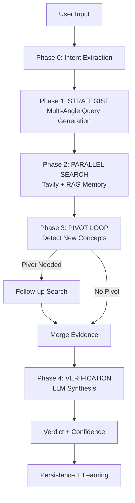

# The 4-Phase Analysis Pipeline

Comprehensive overview of Fact uAI's core analysis pipeline.

---

## Overview

FactuAI uses a **4-phase analysis pipeline** for robust claim verification:

1. **Phase 0: Intent Extraction** - Parse raw text into structured claims
2. **Phase 1: Strategist** - Generate 3 multi-angle search queries per claim
3. **Phase 2: Parallel Search** - Gather evidence from Tavily + internal RAG memory
4. **Phase 3: Pivot Loop** - Detect new concepts → execute follow-up research
5. **Phase 4: Verification** - Synthesize evidence into verdict with confidence

---

## Pipeline Flow Diagram



---

## Phase Summaries

### Phase 0: Intent Extraction (LLM-Based)

**Purpose:** Extract structured, verifiable claims from raw user input.

**Input:** Raw text (e.g., "The Earth is flat and vaccines cause autism")  
**Output:** List of `IntentClaim` objects

```json
[
  {
    "claim_text": "The Earth is flat",
    "search_query": "Earth shape flat evidence",
    "verification_question": "Is the Earth flat?"
  },
  {
    "claim_text": "Vaccines cause autism",
    "search_query": "vaccines autism link scientific studies",
    "verification_question": "Do vaccines cause autism?"
  }
]
```

**Implementation:**
- Uses `LLMIntentAdapter` by default
- Configured via `INTENT_LLM_MODEL` (fast/cheap model recommended)

**See:** [01-intent.md](01-intent.md)

---

### Phase 1: Strategist - Multi-Angle Query Generation

**Purpose:** Generate 3 strategic search queries per claim to maximize evidence quality.

**Input:** Single claim  
**Output:** 3 distinct queries

```json
{
  "factual_query": "shape of Earth scientific consensus",
  "hoax_query": "flat Earth debunked fact-check",
  "scientific_query": "Earth spherical evidence NASA images"
}
```

**Rationale:** Approaching from multiple angles (factual, debunking, scientific) surfaces diverse evidence sources and reduces bias.

**Implementation:**
- LLM prompt engineering
- Each query targets different source types

**See:** [02-strategist.md](02-strategist.md)

---

### Phase 2: Parallel Search - Hybrid External + Internal

**Purpose:** Gather evidence from external APIs (Tavily) and internal knowledge base (pgvector).

**Execution:**
1. Run 3 Tavily searches (factual, hoax, scientific) in parallel via `asyncio.gather`
2. Simultaneously query internal pgvector for similar past claims/evidence
3. Merge results, deduplicate by URL

**External Search (Tavily):**
- **Strict filtering:** ` exclude_domains` blocks 19 social media domains
- **Rich data:** Returns `ai_overview`, `content` (full article), `text` (snippets)
- **Configuration:** `auto_parameters=True`, `include_answer=True`, `include_raw_content=True`

**Internal RAG Search:**
- Query `claims` and `evidence` tables via cosine similarity
- **Threshold:** Only returns results with similarity > 0.80 (distance < 0.20)
- Results tagged with `[INTERNAL MEMORY]`

**Latency:** ~Same as single query (parallel execution)

**See:** [03-search.md](03-search.md)

---

### Phase 3: Pivot Loop - Iterative Research

**Purpose:** Detect if initial evidence reveals a **new specific entity** (product, event, concept) requiring follow-up research.

**Decision Process:**
1. LLM analyzes claim + initial search results
2. Generates `PivotDecision`:
   - `needs_pivot`: boolean
   - `pivot_query`: specific follow-up query
   - `reason`: explanation

**Example:**
```
Claim: "Air Wi-Fi technology is used in the Tesla Pi Phone"
Initial Search: Reveals "Tesla Pi Phone" is a hoax
Pivot Decision: {
  "needs_pivot": true,
  "pivot_query": "Tesla Pi Phone hoax fact-check",
  "reason": "Initial search mentions 'Tesla Pi Phone' as a specific entity requiring dedicated research"
}
```

**Safety:** Hard limit of **1 pivot** per claim (no infinite loops).

**See:** [04-pivot.md](04-pivot.md)

---

### Phase 4: Verification - LLM Synthesis

**Purpose:** Synthesize all evidence into a structured verdict with confidence and reasoning.

**Input:** Claim + merged evidence (from all phases)  
**Output:** Verdict object

```json
{
  "verdict": "false",
  "confidence": 0.95,
  "reasoning": "Multiple scientific sources confirm Earth is an oblate spheroid. No credible evidence supports flat Earth claim. Fact-check sites explicitly debunk this as a common misconception.",
  "evidence": [
    {
      "snippet": "NASA satellite images show...",
      "source_url": "https://nasa.gov/...",
      "relevance_score": 0.98
    }
  ]
}
```

**Implementation:**
- LangChain-based LLM call with structured output
- Prioritizes `ai_overview` and `content` over snippets
- Configurable via `OPENROUTER_MODEL`

**See:** [05-verification.md](05-verification.md)

---

## Post-Processing: Persistence + Learning

After verification completes:

1. **Persistence:** Store verification, claims, sources, evidence in Postgres
2. **Continuous Learning:** If confidence ≥ 0.85:
   - Asynchronously generate embeddings for claim and evidence
   - Store in pgvector columns for future RAG retrieval

See [../05-features/continuous-learning.md](../05-features/continuous-learning.md).

---

## Phase Timing (Typical)

| Phase | Typical Latency |
|-------|----------------|
| Phase 0: Intent | 1-2s |
| Phase 1: Strategist | 0.5-1s |
| Phase 2: Search (parallel) | 3-5s |
| Phase 3: Pivot (if triggered) | +3-5s |
| Phase 4: Verification | 2-3s |
| **Total (no pivot)** | **7-11s** |
| **Total (with pivot)** | **10-16s** |

---

## Example: Full Pipeline Execution

**Input:** "The Great Wall of China is visible from space with the naked eye"

**Phase 0 → Intent:**
```json
{
  "claim_text": "The Great Wall of China is visible from space with the naked eye",
  "search_query": "Great Wall China visible space",
  "verification_question": "Is the Great Wall of China visible from space?"
}
```

**Phase 1 → Strategist:**
- Factual: "Great Wall China visible from space scientific evidence"
- Hoax: "Great Wall space myth debunked"
- Scientific: "Great Wall China satellite imagery visibility"

**Phase 2 → Search:**
- Tavily (3 queries in parallel) → 15 results
- RAG (internal memory) → 2 results tagged `[INTERNAL MEMORY]`
- Merged: 17 unique sources

**Phase 3 → Pivot:**
```json
{
  "needs_pivot": false,
  "reason": "No new specific entities detected; sufficient evidence gathered"
}
```

**Phase 4 → Verification:**
```json
{
  "verdict": "false",
  "confidence": 0.92,
  "reasoning": "Multiple authoritative sources (NASA, fact-check sites) confirm the Great Wall is NOT visible from space with the naked eye. This is a common myth. Low Earth orbit astronauts cannot see it."
}
```

**Persistence + Learning:**
- Stored in DB (confidence 0.92 ≥ 0.85 threshold)
- Embeddings generated and stored for future RAG retrieval

---

## Phase Deep Dives

For detailed documentation on each phase:

- [Phase 0: Intent Extraction](01-intent.md)
- [Phase 1: Strategist (Multi-Angle Queries)](02-strategist.md)
- [Phase 2: Parallel Search (Tavily + RAG)](03-search.md)
- [Phase 3: Pivot Loop](04-pivot.md)
- [Phase 4: Verification](05-verification.md)

---

See also:
- [Architecture Overview](../03-architecture/overview.md)
- [Features](../05-features/)
- [Testing with Benchmark Claims](../06-testing/test-claims.md)
