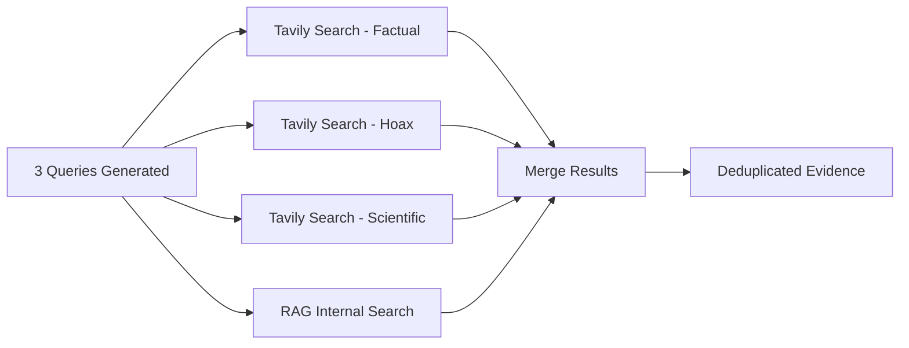

# Phase 2: Parallel Search

How FactuAI gathers evidence from Tavily and internal RAG memory in parallel.

---

## Purpose

Execute 3 search queries (factual, hoax, scientific) simultaneously + query internal pgvector knowledge base.

---

## Architecture



---

## External Search: Tavily

**Configuration:**
```python
# Strict social media filtering
exclude_domains = [
    "facebook.com", "tiktok.com", "twitter.com", "x.com",
    "reddit.com", "instagram.com", "youtube.com", 
    # ... 19 total domains
]

response = await tavily.search(
    query=query,
    exclude_domains=exclude_domains,
    include_answer=True,
    include_raw_content=True
)
```

**Returns:**
- `ai_overview`: Tavily's AI-generated summary
- `content`: Full article text
- `text`: Snippets
- `url`, `title`: Source metadata

---

## Internal Search: RAG Memory

**Query Process:**
1. Generate embedding for search query
2. Query `claims` table via cosine similarity
3. Query `evidence` table via cosine similarity
4. **Threshold:** Only include results with similarity > 0.80 (distance < 0.20)
5. Tag results with `[INTERNAL MEMORY]`

**SQL Query:**
```sql
SELECT claim_text, 
       1 - (claim_embedding <=> :query_embedding) AS similarity
FROM claims
WHERE 1 - (claim_embedding <=> :query_embedding) > 0.80
ORDER BY claim_embedding <=> :query_embedding
LIMIT 5;
```

---

## Parallel Execution

```python
import asyncio

# Execute all searches in parallel
results = await asyncio.gather(
    tavily_search(factual_query),
    tavily_search(hoax_query),
    tavily_search(scientific_query),
    rag_search(claim_text),
    return_exceptions=True  # Fail-safe
)
```

**Latency:** ~Same as single query (~3-5s)

---

## Deduplication & Merging

1. **Deduplicate by URL:** Keep highest-scoring result per source
2. **Merge metadata:** Combine `ai_overview`, `content`, `text`
3. **Preserve source diversity:** Balance between sources

---

See also:
- [Pipeline Overview](00-overview.md)
- [Source Filtering](../05-features/source-filtering.md)
- [Continuous Learning](../05-features/continuous-learning.md)
