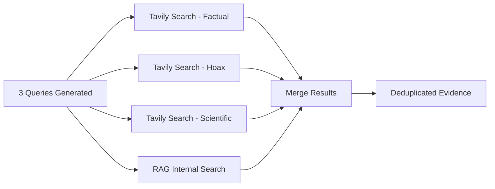

# Phase 2: Parallel Search

How FactuAI gathers evidence using hybrid external + internal search.

---

## Purpose

**Quick Mode:** Execute single direct search (15 results)  
**Deep Mode:** Execute 3 queries (factual, hoax, scientific) in parallel + internal RAG (5 results per query)

---

## Search Method: `hybrid_search()`

**Location:** `backend/app/features/search/ports.py`

**Signature:**
```python
async def hybrid_search(
    self,
    *,
    query: str,
    max_results: int = 8,  # Results per query
    providers: Optional[List[str]] = None,  # Default: ["tavily"]
    verification_question: Optional[str] = None,  # Optional context
) -> List[EvidenceSnippet]:
```

**Features:**
- Searches external providers (Tavily) + internal RAG simultaneously
- Automatic deduplication by URL
- Social media domain filtering (19 blocked domains)
- Returns merged, deduplicated results

---

## Architecture



---

## External Search: Tavily

**Configuration:**
```python
# Strict social media filtering
exclude_domains = [
    "facebook.com", "tiktok.com", "twitter.com", "x.com",
    "reddit.com", "instagram.com", "youtube.com", 
    # ... 19 total domains
]

response = await tavily.search(
    query=query,
    exclude_domains=exclude_domains,
    include_answer=True,
    include_raw_content=True
)
```

**Returns:**
- `ai_overview`: Tavily's AI-generated summary
- `content`: Full article text
- `text`: Snippets
- `url`, `title`: Source metadata

---

## Internal Search: RAG Memory

**Query Process:**
1. Generate embedding for search query
2. Query `claims` table via cosine similarity
3. Query `evidence` table via cosine similarity
4. **Threshold:** Only include results with similarity > 0.80 (distance < 0.20)
5. Tag results with `[INTERNAL MEMORY]`

**SQL Query:**
```sql
SELECT claim_text, 
       1 - (claim_embedding <=> :query_embedding) AS similarity
FROM claims
WHERE 1 - (claim_embedding <=> :query_embedding) > 0.80
ORDER BY claim_embedding <=> :query_embedding
LIMIT 5;
```

---

## Parallel Execution (Deep Mode)

**Implementation:** `backend/app/features/analyze/service.py`

```python
async def _search_parallel(
    self,
    *,
    queries: List[str],  # 3 queries from Strategist
    search: SearchPort,
    max_results_per_query: int = 5,
) -> List[EvidenceSnippet]:
    """Execute multiple search queries in parallel using asyncio.gather."""
    
    # Execute all searches concurrently
    results_lists = await asyncio.gather(
        *[
            search.hybrid_search(
                query=q,
                max_results=max_results_per_query,
                providers=None,  # Uses default providers
                verification_question=None,
            )
            for q in queries
        ],
        return_exceptions=True,  # Continue even if one search fails
    )
    
    # Flatten and merge results
    all_results = []
    for results in results_lists:
        if isinstance(results, list):
            all_results.extend(results)
    
    # Deduplicate by URL (keeps first occurrence)
    return self._merge_evidence(all_results, [])
```

**Latency:** ~Same as single query (~3-5s) due to parallel execution

---

## Deduplication & Merging

**Method:** `_merge_evidence()` in `AnalyzeService`

**Logic:**
1. **Normalize URLs:** Convert all URLs to lowercase, strip fragments
2. **Track seen URLs:** Use set to track unique URLs
3. **Keep first occurrence:** If URL already seen, skip duplicate
4. **Preserve order:** Maintains original result ordering
5. **Merge lists:** Combines initial + pivot results

**Example:**
```python
def _merge_evidence(
    self,
    existing: List[EvidenceSnippet],
    new: List[EvidenceSnippet],
) -> List[EvidenceSnippet]:
    """Merge evidence lists, deduplicating by normalized URL."""
    seen_urls = set()
    merged = []
    
    for item in existing + new:
        url_normalized = normalize_url(item.get("url", ""))
        if url_normalized and url_normalized not in seen_urls:
            seen_urls.add(url_normalized)
            merged.append(item)
    
    return merged
```

---

See also:
- [Pipeline Overview](00-overview.md)
- [Source Filtering](../05-features/source-filtering.md)
- [Continuous Learning](../05-features/continuous-learning.md)
