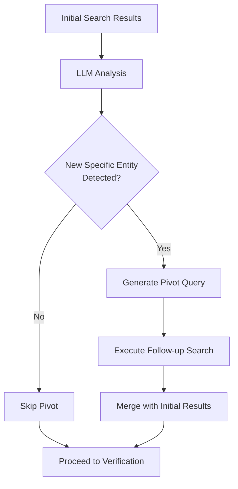

# Phase 3: Pivot Loop

Iterative research when initial evidence reveals new concepts requiring follow-up.

---

## Purpose

Detect if initial search results reveal a **new specific entity** (product, event, concept) that requires dedicated research.

**Without Pivot:** Single-pass search might miss critical context about newly discovered entities.

**With Pivot:** System can perform follow-up research on specific entities mentioned in initial evidence.

---

## How It Works

### Decision Process



### Pivot Decision Criteria

The LLM evaluates:
1. **Specificity:** Is there a named entity (product, person, event)?
2. **Relevance:** Is this entity central to evaluating the claim?
3. **Novelty:** Was this entity NOT in the original claim?

---

## Example: Pivot Triggered

**Original Claim:** "Air Wi-Fi technology enables internet without routers"

**Initial Search Results:** Mentions "Tesla Pi Phone" as using Air Wi-Fi

**Pivot Decision:**
```json
{
  "needs_pivot": true,
  "pivot_query": "Tesla Pi Phone real fake hoax fact-check",
  "reason": "Initial search revealed 'Tesla Pi Phone' as a specific product claim requiring dedicated research"
}
```

**Follow-up Search:** Discovers Tesla Pi Phone is a widely debunked hoax

**Final Verdict:** FALSE (high confidence) - both Air Wi-Fi and Tesla Pi Phone are hoaxes

---

## Example: Pivot Skipped

**Claim:** "The Great Wall of China is visible from space"

**Initial Search Results:** Multiple authoritative sources (NASA, fact-check sites)

**Pivot Decision:**
```json
{
  "needs_pivot": false,
  "reason": "Sufficient evidence gathered; no new specific entities requiring follow-up"
}
```

---

## Safety Constraints

### Hard Limit: 1 Pivot Maximum

**Why?**
- Prevents infinite loops
- Controls latency (each pivot adds ~3-5s)
- Most claims don't need >1 pivot

**Implementation:**
```python
MAX_PIVOTS = 1
pivots_executed = 0

if should_pivot and pivots_executed < MAX_PIVOTS:
    execute_pivot_search()
    pivots_executed += 1
```

---

## LLM Prompt Structure

**Location:** `backend/app/features/analyze/prompts.py`

### Pydantic Model

```python
class PivotDecision(BaseModel):
    """Structured output for pivot loop decision."""
    
    needs_pivot: bool = Field(
        description="True if evidence reveals a specific entity/concept that requires additional research."
    )
    pivot_query: Optional[str] = Field(
        default=None,
        description="Search query for the newly discovered concept (if needs_pivot is True)."
    )
    reason: str = Field(
        description="Brief explanation of why pivot is needed or not needed."
    )
```

### Actual Prompts

**System Prompt:**
```
Analyze search results to determine if a NEW specific entity (product, event, person, company) central to the claim requires additional research.

**Pivot Required (needs_pivot=True):**
- Evidence reveals specific entity misrepresented by rumor (e.g., "Tesla Pi Phone" hoax)
- Crucial event/study emerges not in original search (e.g., Wakefield 1998 study)
- Proper noun appears as "root cause" of rumor

**No Pivot (needs_pivot=False):**
- Evidence directly addresses claim
- Simple factual question (dates, measurements)
- No new specific entity discovered
- Concept already covered by original queries

Be CONSERVATIVE. Only pivot for truly new, specific entities. Pivot query: 3-6 words maximum.
```

**Human Prompt:**
```
CLAIM: {claim}

QUERIES USED: {queries}

EVIDENCE:
{evidence_summary}

Does evidence reveal a NEW specific entity requiring research?
```

**Note:** `evidence_summary` uses first 5 results with truncated snippets (250 chars) to save tokens.

---

## Code Implementation

**Location:** `backend/app/features/analyze/service.py`

```python
async def _execute_pivot_loop(
    self,
    *,
    claim: str,
    original_queries: List[str],
    evidence: List[EvidenceSnippet],
    search,
    model: str,
) -> List[EvidenceSnippet]:
    """Execute the Pivot Loop - check if follow-up search is needed.
    
    Returns additional evidence from pivot search, or empty list if no pivot needed.
    Only executes ONE pivot (no infinite loops).
    """
    # Check if pivot is needed using LLM
    pivot_decision = await self._check_pivot_needed(
        claim=claim,
        queries=original_queries,
        evidence=evidence,
        model=model,
        api_key=api_key,
        base_url=base_url,
    )
    
    if not pivot_decision.needs_pivot or not pivot_decision.pivot_query:
        logger.info(f"[PIVOT] Skipped: {pivot_decision.reason}")
        return []
    
    # Execute pivot search
    pivot_query = pivot_decision.pivot_query.strip()
    logger.info(f"[PIVOT] Triggered: \"{pivot_query}\" - {pivot_decision.reason}")
    
    pivot_results = await search.hybrid_search(
        query=pivot_query,
        max_results=5,
        providers=None,
        verification_question=None,
    )
    
    logger.info(f"[PIVOT] Found {len(pivot_results)} additional results")
    return pivot_results
```

**Temperature:** `0.1` (low temperature for consistent pivot decisions)

**Recommended Model:** Use `openai/gpt-4o-mini` for reliable structured output. Free-tier models may return plain text instead of JSON, causing the pivot to be skipped.

---

## When Pivot Is Most Valuable

### Scenario 1: Product Claims
**Claim:** "X product has Y feature"  
**Pivot:** Research X product authenticity

### Scenario 2: Event Claims
**Claim:** "Event X happened"  
**Pivot:** Research Event X details/verification

### Scenario 3: Conspiracy Theories
**Claim:** References obscure conspiracy  
**Pivot:** Research the specific conspiracy theory

---

## Performance Impact

**Without Pivot:**
- Latency: ~7-11s
- Risk: Missing critical context

**With Pivot:**
- Latency: ~10-16s (+3-5s)
- Benefit: Comprehensive evidence gathering

---

## Testing

```python
#backend/tests/test_pivot.py
async def test_pivot_triggered():
    claim = "Air Wi-Fi powers the Tesla Pi Phone"
    initial_results = [...]  # Mentions Tesla Pi Phone
    
    decision = await analyze_service._should_pivot(claim, initial_results)
    
    assert decision.needs_pivot is True
    assert "Tesla Pi Phone" in decision.pivot_query
```

---

## Code Pointers

- Implementation: `backend/app/features/analyze/service.py` (`_execute_pivot_loop()`)
- Decision logic: LLM-based (uses `OPENROUTER_MODEL`)

---

See also:
- [Pipeline Overview](00-overview.md)
- [Phase 2: Parallel Search](03-search.md)
- [Phase 4: Verification](05-verification.md)
