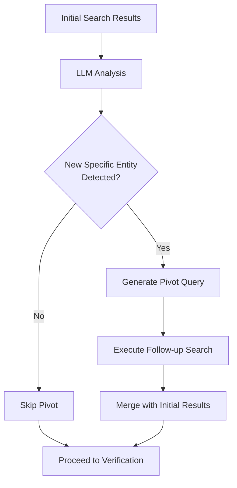

# Phase 3: Pivot Loop

Iterative research when initial evidence reveals new concepts requiring follow-up.

---

## Purpose

Detect if initial search results reveal a **new specific entity** (product, event, concept) that requires dedicated research.

**Without Pivot:** Single-pass search might miss critical context about newly discovered entities.

**With Pivot:** System can perform follow-up research on specific entities mentioned in initial evidence.

---

## How It Works

### Decision Process



### Pivot Decision Criteria

The LLM evaluates:
1. **Specificity:** Is there a named entity (product, person, event)?
2. **Relevance:** Is this entity central to evaluating the claim?
3. **Novelty:** Was this entity NOT in the original claim?

---

## Example: Pivot Triggered

**Original Claim:** "Air Wi-Fi technology enables internet without routers"

**Initial Search Results:** Mentions "Tesla Pi Phone" as using Air Wi-Fi

**Pivot Decision:**
```json
{
  "needs_pivot": true,
  "pivot_query": "Tesla Pi Phone real fake hoax fact-check",
  "reason": "Initial search revealed 'Tesla Pi Phone' as a specific product claim requiring dedicated research"
}
```

**Follow-up Search:** Discovers Tesla Pi Phone is a widely debunked hoax

**Final Verdict:** FALSE (high confidence) - both Air Wi-Fi and Tesla Pi Phone are hoaxes

---

## Example: Pivot Skipped

**Claim:** "The Great Wall of China is visible from space"

**Initial Search Results:** Multiple authoritative sources (NASA, fact-check sites)

**Pivot Decision:**
```json
{
  "needs_pivot": false,
  "reason": "Sufficient evidence gathered; no new specific entities requiring follow-up"
}
```

---

## Safety Constraints

### Hard Limit: 1 Pivot Maximum

**Why?**
- Prevents infinite loops
- Controls latency (each pivot adds ~3-5s)
- Most claims don't need >1 pivot

**Implementation:**
```python
MAX_PIVOTS = 1
pivots_executed = 0

if should_pivot and pivots_executed < MAX_PIVOTS:
    execute_pivot_search()
    pivots_executed += 1
```

---

## LLM Prompt Structure

```python
prompt = f"""
Analyze this claim and search results:

Claim: "{claim_text}"
Search Results: {results_summary}

Determine if there's a new specific entity (product, event, person) that requires follow-up research.

Return JSON:
{{
  "needs_pivot": bool,
  "pivot_query": "specific search query" or null,
  "reason": "explanation"
}}

Guidelines:
- Only pivot for SPECIFIC entities (not vague concepts)
- Entity must be CENTRAL to claim evaluation
- Entity should NOT have been in original claim
"""
```

---

## When Pivot Is Most Valuable

### Scenario 1: Product Claims
**Claim:** "X product has Y feature"  
**Pivot:** Research X product authenticity

### Scenario 2: Event Claims
**Claim:** "Event X happened"  
**Pivot:** Research Event X details/verification

### Scenario 3: Conspiracy Theories
**Claim:** References obscure conspiracy  
**Pivot:** Research the specific conspiracy theory

---

## Performance Impact

**Without Pivot:**
- Latency: ~7-11s
- Risk: Missing critical context

**With Pivot:**
- Latency: ~10-16s (+3-5s)
- Benefit: Comprehensive evidence gathering

---

## Testing

```python
#backend/tests/test_pivot.py
async def test_pivot_triggered():
    claim = "Air Wi-Fi powers the Tesla Pi Phone"
    initial_results = [...]  # Mentions Tesla Pi Phone
    
    decision = await analyze_service._should_pivot(claim, initial_results)
    
    assert decision.needs_pivot is True
    assert "Tesla Pi Phone" in decision.pivot_query
```

---

## Code Pointers

- Implementation: `backend/app/features/analyze/service.py` (`_execute_pivot_loop()`)
- Decision logic: LLM-based (uses `OPENROUTER_MODEL`)

---

See also:
- [Pipeline Overview](00-overview.md)
- [Phase 2: Parallel Search](03-search.md)
- [Phase 4: Verification](05-verification.md)
