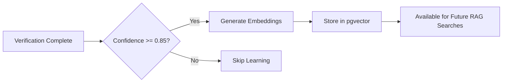

# Continuous Learning (RAG Feedback Loop)

How FactuAI learns from high-confidence verifications to improve future searches.

---

## Overview

After completing a **high-confidence verification** (confidence ≥ 0.85), FactuAI asynchronously:

1. Generates embeddings for the claim and evidence
2. Stores embeddings in pgvector columns
3. Future searches query this internal knowledge base

**Result:** The system gets smarter over time, retrieving past verifications similar to current claims.

---

## How It Works



---

## Configuration

### Environment Variables

| Variable | Default | Description |
|----------|---------|-------------|
| `EMBEDDING_API_BASE_URL` | - | Embedding service URL (e.g., Infinity) |
| `EMBEDDING_API_KEY` | - | API key for embedding service |
| `EMBEDDING_MODEL` | `BAAI/bge-small-en-v1.5` | Embedding model name |
| `EMBEDDING_DIM` | `384` | Vector dimension |
| `LEARNING_CONFIDENCE_THRESHOLD` | `0.85` | Minimum confidence to trigger learning |

**Example:**
```bash
# backend/.env
EMBEDDING_API_BASE_URL=http://localhost:7997
EMBEDDING_MODEL=BAAI/bge-small-en-v1.5
EMBEDDING_DIM=384
LEARNING_CONFIDENCE_THRESHOLD=0.85
```

---

## Embedding Generation

### Claims

```python
# Generate embedding for claim text
embedding = await embedding_service.generate(claim.claim_text)

# Store in database
claim.claim_embedding = embedding  # VECTOR(384) column
await session.commit()
```

### Evidence

```python
# Generate embeddings for all evidence snippets
for evidence in claim.evidence:
    embedding = await embedding_service.generate(evidence.snippet)
    evidence.snippet_embedding = embedding
    
await session.commit()
```

---

## RAG Retrieval (Phase 2: Search)

During the search phase, the system queries internal memory:

```sql
-- Find similar claims
SELECT claim_text, 
       1 - (claim_embedding <=> :query_embedding) AS similarity,
       verdict,
       confidence
FROM claims
WHERE 1 - (claim_embedding <=> :query_embedding) > 0.80
ORDER BY claim_embedding <=> :query_embedding
LIMIT 5;
```

**Threshold:** Similarity > 0.80 (cosine distance < 0.20)

**Results:** Tagged with `[INTERNAL MEMORY]` prefix

---

## Example: Learning in Action

### Initial Verification

**Claim:** "Vaccines cause autism"  
**Verdict:** FALSE (confidence 0.98)  
**Action:** Embeddings generated and stored ✅

### Future Query (Similar Claim)

**Claim:** "Do vaccines lead to autism in children?"  
**Search Phase:**
- External (Tavily): 12 results
- **Internal (RAG):** 1 result (similarity 0.92)
  - `[INTERNAL MEMORY] "Vaccines cause autism" - FALSE (0.98 confidence)`

**Benefit:** System immediately knows this is a debunked claim from past verification.

---

## Fail-Safe Design

### Learning Failures Never Crash Main Flow

```python
try:
    await store_embeddings(claim)
except Exception as e:
    logger.error(f"Learning failed: {e}")
    # Continue - don't crash verification
```

**Why this matters:**
- Embedding service might be down
- Network issues
- The verification is more important than learning

---

## Data Hygiene

### When to Purge Knowledge Base

After significant changes to filtering rules or verification logic:

```sql
-- Clear all embeddings (reset knowledge base)
UPDATE claims SET claim_embedding = NULL;
UPDATE evidence SET snippet_embedding = NULL;
```

**Rationale:** Prevents "poisoned" data from old logic corrupting new retrieval.

---

## Performance Considerations

### Async Execution

Learning happens **after** the verification response is returned to the user:

```python
# Return response immediately
response = AnalyzeResponse(...)
await response.send()

# Then learn asynchronously (non-blocking)
asyncio.create_task(learn_from_verification(result))
```

**Latency Impact:** Zero (learning is async)

### pgvector Index

```sql
CREATE INDEX idx_claims_embedding 
ON claims USING hnsw (claim_embedding vector_cosine_ops);
```

**HNSW Index:** Enables fast similarity search (approximate nearest neighbors)

---

## Monitoring

### Check Learning Stats

```sql
-- How many claims have embeddings?
SELECT COUNT(*) FROM claims WHERE claim_embedding IS NOT NULL;

-- Average confidence of learned claims
SELECT AVG(confidence) FROM claims WHERE claim_embedding IS NOT NULL;

-- Most common verdicts in knowledge base
SELECT verdict, COUNT(*) 
FROM claims 
WHERE claim_embedding IS NOT NULL
GROUP BY verdict;
```

---

## Future Enhancements

- **Active Learning:** Prioritize claims needing more evidence
- **Decay Function:** Weight recent verifications higher
- **Clustering:** Group similar claims for insights
- **Quality Filtering:** Only learn from manually reviewed verifications

---

## Code Pointers

- Embedding generation: `backend/app/features/analyze/service.py` (learning logic)
- RAG retrieval: `backend/app/features/search/adapters/native.py` (`_search_internal()`)
- Database schema: See [Database Schema](../03-architecture/database.md)

---

See also:
- [Phase 2: Parallel Search](../04-pipeline/03-search.md) - RAG retrieval
- [Database Schema](../03-architecture/database.md) - pgvector columns
- [Environment Vars](../02-setup/environment-vars.md) - Embedding configuration
