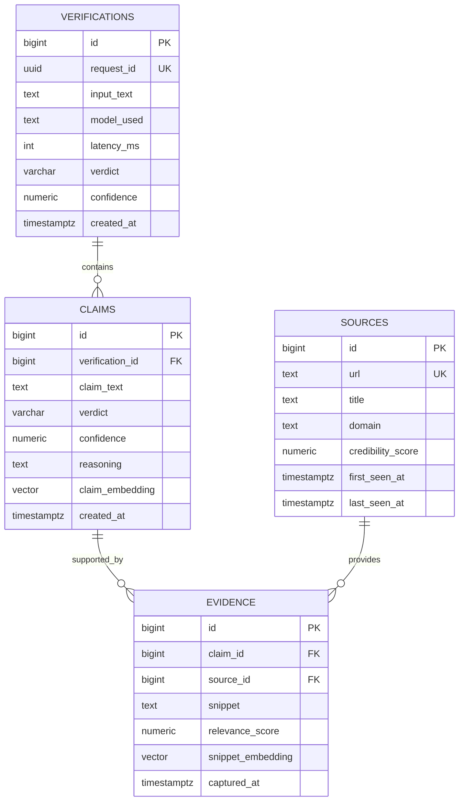

# Architecture

## High-Level Flow

A request typically follows this shape:

1. **Analyze** feature receives the request (API boundary)
2. **Intent** extracts structured claim items (what to check)
3. **Search** gathers evidence from pluggable providers (OCP)
4. **Verification** grades claim(s) using LangChain (`langchain-openai`) over an OpenAI-compatible LLM endpoint (async + structured outputs)
5. **Persistence** stores claim/evidence/verification results in Postgres
6. **Continuous Learning** (RAG feedback loop) writes embeddings to pgvector for future retrieval

## API Surface

- `GET /health` (liveness)
- `POST /api/analyze` (multi-claim analysis)

Request/response schemas are defined in `backend/app/features/analyze/schemas.py`.

## Data Model (Postgres + pgvector)

The authoritative schema is in `backend/migrations/*.sql`.

Core tables:
- `verifications` (top-level request record)
- `claims` (one row per extracted claim)
- `sources` (normalized source metadata)
- `evidence` (snippets tied to a claim + source)

Embeddings:
- `claims.claim_embedding VECTOR(384)`
- `evidence.snippet_embedding VECTOR(384)`

Uniqueness:
- `evidence` enforces `UNIQUE (claim_id, source_id, snippet)` to reduce duplicate snippets.

### ER Diagram (Conceptual)



## Backend Layout (Vertical Slice Architecture)

Backend code lives under `backend/app/` and is organized by feature:

- `backend/app/features/analyze/`
- `backend/app/features/intent/`
- `backend/app/features/search/`
- `backend/app/features/verification/`

Each feature owns its router + orchestration logic + ports, and may have adapters/persistence.

### Shared Infrastructure

Extraction utilities (web scraping, OCR, video transcription) live under `backend/app/infrastructure/extraction/` to avoid cross-feature coupling.

### Cross-Feature Contracts

Shared types that legitimately cross feature boundaries live in `backend/app/contracts/`.

Rule: **features do not import other features**. If you need shared types, add them to `contracts`.

## Dependency Injection (OCP)

The DI container is configured in `backend/app/core/container.py` and driven by environment variables in `backend/app/core/settings.py`.

Key bindings:
- `INTENT_ADAPTER`
- `SEARCH_ADAPTER`
- `VERIFIER_ADAPTER`

This allows replacing implementations without changing feature orchestration code.

## Search Providers (Plugin Model)

Search is composed from provider classes listed in `SEARCH_PROVIDER_PATHS`.

Add a provider by:
1. Creating a new provider class in `backend/app/features/search/providers/`
2. Adding its dotted path to `SEARCH_PROVIDER_PATHS`

No changes should be required in the orchestrator.

## Data & Continuous Learning (pgvector)

Postgres stores facts/check artifacts and embeddings.

- Schema migrations live in `backend/migrations/*.sql` and are applied on startup.
- pgvector is used to store embeddings for future retrieval and relevance ranking.

Learning rule:
- After a **high-confidence** verification, the system asynchronously computes embeddings and stores them into pgvector columns.

## Async-First Rules

All external I/O is truly async:
- DB: SQLAlchemy async + asyncpg
- HTTP: httpx AsyncClient
- Redis: redis.asyncio

No sync wrappers or thread bridges for core logic.

## Frontend Architecture

The frontend follows similar principles to the backend, with feature-centric organization.

### Feature Modules

Domain-specific logic is colocated in feature modules under `frontend/src/features/`:

```
frontend/src/features/ai-providers/
├── index.ts          # Barrel exports (single entry point)
├── types.ts          # Type definitions
├── constants.ts      # Shared constants
├── registry.ts       # Model/provider registry
├── components/
│   ├── PipelineModelConfig.tsx   # Pipeline task model configuration UI
│   └── ai-components.tsx         # ActiveModelDisplay, ModelSelector
└── stores/
    ├── selection.ts  # AI model selection (Zustand)
    └── pipeline.ts   # Pipeline task models (Zustand)
```

### Import Pattern

```ts
// All AI provider functionality from single entry point
import { 
  useAIStore, 
  modelRegistry, 
  getModelById 
} from '@/features/ai-providers';
```

### Configuration

- **Feature modules**: `frontend/src/features/*/` (domain-specific)
- **Static config**: `frontend/src/config/` (simple static data)
- **Shared hooks**: `frontend/src/lib/hooks/`
- **Types**: Colocated in feature modules, or `frontend/src/types/` for cross-cutting

