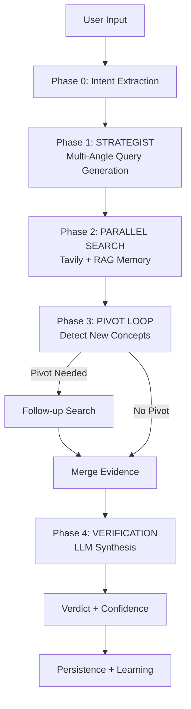
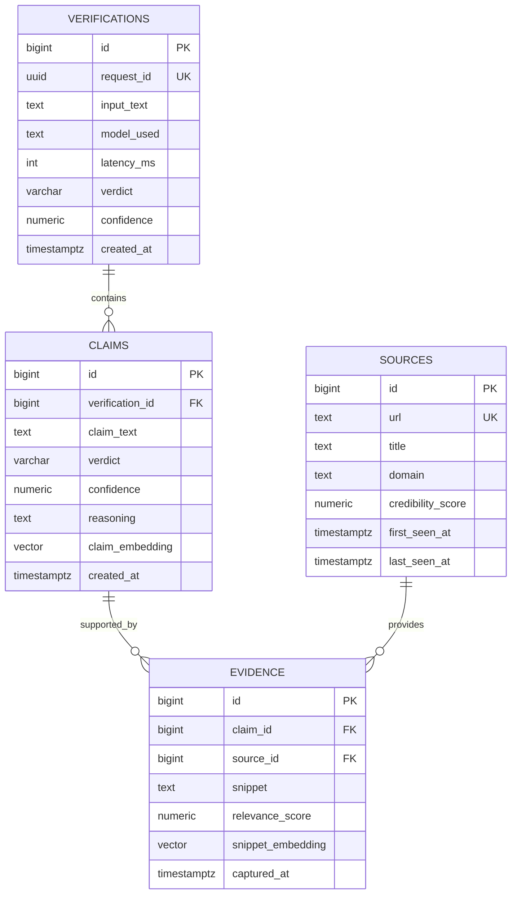

# Architecture

## High-Level Flow: The 4-Phase Analysis Pipeline

FactuAI uses a sophisticated multi-stage pipeline for robust claim verification:



### Phase 0: Intent Extraction (LLM-Based)
- **Input**: Raw user text
- **Process**: `LLMIntentAdapter` extracts structured, verifiable claims
- **Output**: List of `IntentClaim` objects (claim_text, search_query, verification_question)
- **Model**: Configurable via `INTENT_LLM_MODEL` (default: fast/cheap model)

### Phase 1: STRATEGIST - Multi-Angle Query Generation
- **Input**: Single claim
- **Process**: LLM generates 3 strategic search queries:
  1. **Factual Query**: Direct fact-checking (primary sources)
  2. **Hoax Query**: Debunking-focused (fact-check sites, exposés)
  3. **Scientific Query**: Academic/research angle (studies, expert analysis)
- **Output**: List of 3 distinct queries
- **Rationale**: Approaching from multiple angles maximizes evidence quality

### Phase 2: PARALLEL SEARCH - Hybrid External + Internal
- **External (Tavily)**: 
  - Executes 3 queries in parallel via `asyncio.gather`
  - **Strict Filtering**: `exclude_domains` blocks social media (Facebook, TikTok, Reddit, etc.)
  - Returns: `ai_overview` (Tavily's AI summary) + `content` (full article text) + `text` (snippets)
- **Internal (RAG Memory)**:
  - Generates query embedding via Infinity service
  - Searches `claims` and `evidence` tables using pgvector cosine distance
  - **Threshold**: Only returns results with similarity > 0.80 (distance < 0.20)
  - Results prefixed with `[INTERNAL MEMORY]` tag
- **Merge**: Deduplicates by URL, keeps highest-scoring result per source
- **Latency**: ~Same as single query (parallel execution)

### Phase 3: PIVOT LOOP - Iterative Research
- **Input**: Original claim + initial search results
- **Process**: LLM analyzes evidence to detect if a **new specific entity** (product, event, concept) emerged that requires follow-up research
- **Decision**: `PivotDecision` (needs_pivot: bool, pivot_query: str, reason: str)
- **Execution**: If pivot needed, executes **one** additional search and merges results
- **Safety**: Hard limit of 1 pivot (no infinite loops)
- **Example**: Claim about "Air Wi-Fi" reveals "Tesla Pi Phone" hoax → pivot search for "Tesla Pi Phone"

### Phase 4: VERIFICATION - LLM Synthesis
- **Input**: Claim + merged evidence (from all sources)
- **Process**: LangChain-based LLM call with structured output
- **Evidence Format**: Prioritizes `ai_overview` and `content` over snippets
- **Output**: Verdict (true/false/mostly_true/mostly_false/mixed/unverifiable) + confidence + reasoning
- **Model**: Configurable via `OPENROUTER_MODEL`

### Post-Processing: Persistence + Learning
- **Persistence**: Stores verification, claims, sources, evidence in Postgres
- **Continuous Learning**: If confidence ≥ 0.85, asynchronously generates embeddings and stores in pgvector for future RAG retrieval

## API Surface

- `GET /health` (liveness)
- `POST /api/analyze` (multi-claim analysis)

Request/response schemas are defined in `backend/app/features/analyze/schemas.py`.

## Data Model (Postgres + pgvector)

The authoritative schema is in `backend/migrations/*.sql`.

Core tables:
- `verifications` (top-level request record)
- `claims` (one row per extracted claim)
- `sources` (normalized source metadata)
- `evidence` (snippets tied to a claim + source)

Embeddings:
- `claims.claim_embedding VECTOR(384)`
- `evidence.snippet_embedding VECTOR(384)`

Uniqueness:
- `evidence` enforces `UNIQUE (claim_id, source_id, snippet)` to reduce duplicate snippets.

### ER Diagram (Conceptual)



## Backend Layout (Vertical Slice Architecture)

Backend code lives under `backend/app/` and is organized by feature:

- `backend/app/features/analyze/`
- `backend/app/features/intent/`
- `backend/app/features/search/`
- `backend/app/features/verification/`

Each feature owns its router + orchestration logic + ports, and may have adapters/persistence.

> **Note**: Intent extraction uses `LLMIntentAdapter` by default (LLM-based claim parsing). The legacy regex-based native adapter has been removed.

### Shared Infrastructure

Extraction utilities (web scraping, OCR, video transcription) live under `backend/app/infrastructure/extraction/` to avoid cross-feature coupling.

### Cross-Feature Contracts

Shared types that legitimately cross feature boundaries live in `backend/app/contracts/`.

Rule: **features do not import other features**. If you need shared types, add them to `contracts`.

## Dependency Injection (OCP)

The DI container is configured in `backend/app/core/container.py` and driven by environment variables in `backend/app/core/settings.py`.

Key bindings:
- `INTENT_ADAPTER`
- `SEARCH_ADAPTER`
- `VERIFIER_ADAPTER`

This allows replacing implementations without changing feature orchestration code.

## Search Providers (Plugin Model)

Search is composed from provider classes listed in `SEARCH_PROVIDER_PATHS`.

**Current Configuration (Production-Grade)**:
- **Tavily** (sole external provider)
  - Strict domain filtering via `exclude_domains` (blocks 19 social media domains)
  - Rich data: `ai_overview`, `content`, `text`
  - Configuration: `auto_parameters=True`, `include_answer=True`, `include_raw_content=True`

**Internal RAG Provider**:
- Searches `claims` and `evidence` tables via pgvector
- Similarity threshold: 0.80 (distance < 0.20)
- Results tagged with `[INTERNAL MEMORY]`

Add a provider by:
1. Creating a new provider class in `backend/app/features/search/providers/`
2. Adding its dotted path to `SEARCH_PROVIDER_PATHS`

No changes should be required in the orchestrator.

## Data & Continuous Learning (pgvector)

Postgres stores facts/check artifacts and embeddings.

- Schema migrations live in `backend/migrations/*.sql` and are applied on startup.
- pgvector is used to store embeddings for future retrieval and relevance ranking.

Learning rule:
- After a **high-confidence** verification, the system asynchronously computes embeddings and stores them into pgvector columns.

## Async-First Rules

All external I/O is truly async:
- DB: SQLAlchemy async + asyncpg
- HTTP: httpx AsyncClient
- Redis: redis.asyncio

No sync wrappers or thread bridges for core logic.

## Frontend Architecture

The frontend follows similar principles to the backend, with feature-centric organization.

### Feature Modules

Domain-specific logic is colocated in feature modules under `frontend/src/features/`.

#### Optimistic UI Patterns
- **Analysis Pipeline**: The `PipelineStepLoader` component provides immediate visual feedback for the 4-phase process (Intent -> Strategy -> Search -> Verify) using optimistic state transitions, ensuring perceived performance while the backend executes complex chains.


```
frontend/src/features/ai-providers/
├── index.ts          # Barrel exports (single entry point)
├── types.ts          # Type definitions
├── constants.ts      # Shared constants
├── registry.ts       # Model/provider registry
├── components/
│   ├── PipelineModelConfig.tsx   # Pipeline task model configuration UI
│   └── ai-components.tsx         # ActiveModelDisplay, ModelSelector
└── stores/
    ├── selection.ts  # AI model selection (Zustand)
    └── pipeline.ts   # Pipeline task models (Zustand)

frontend/src/features/search/
├── index.ts          # Barrel exports
├── components/       # SearchInput, SearchProviders
└── hooks/            # useSearch

frontend/src/features/analyze/
├── index.ts          # Barrel exports
├── components/       # AnalyzeCard, ResultsDisplay
└── hooks/            # useAnalyze

frontend/src/features/history/
├── index.ts          # Barrel exports
├── components/       # HistoryPanel, HistoryItem
└── hooks/            # useHistory
```

> **Warning**: Domain components *must* live in `frontend/src/features/*/`, NOT in `components/`. See `CONSTITUTION.md` for enforcement.

### Import Pattern

```ts
// All AI provider functionality from single entry point
import { 
  useAIStore, 
  modelRegistry, 
  getModelById 
} from '@/features/ai-providers';
```

### Configuration

- **Feature modules**: `frontend/src/features/*/` (domain-specific)
- **Static config**: `frontend/src/config/` (simple static data)
- **Shared hooks**: `frontend/src/lib/hooks/`
- **Types**: Colocated in feature modules, or `frontend/src/types/` for cross-cutting

